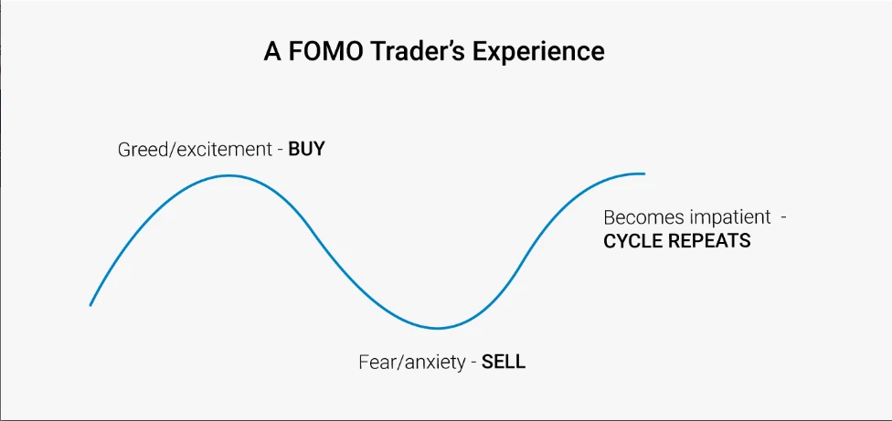

# XBN - Building DeFi Ecosystem

> URL: [https://docs.xbn.finance](https://docs.xbn.finance)
>
> Suggest Edit here: [https://github.com/ElasticBTC-XBT/docs.xbn.finance](https://github.com/ElasticBTC-XBT/docs.xbn.finance)

## XBN - Powering the next Big Things on EVMs

Hello, world!

The world is not fair, even with Bitcoin; many people missed the chance to buy Bitcoin when it less than 100$, and many people did not even know what is Binance when BNB was less than 2$. XBN wants to be one of the second chances for those people to get on board.

### There will be always XBN airdrop for everyone

You can always help your friends to have some XBN by joining the airdrop here: [https://www.xbn.finance/xbn/airdrop/](https://www.xbn.finance/xbn/airdrop/)

Why do we always give away XBN forever? because it's the way to get people on board and build a strong community for XBN. **1 XBN = 1 BNB when there are a lot of people holding XBN and it really becomes a community coin.**

Airdrop is for new people, do not try to game the system and profit from it.

### What is the point of reaching 1 BNB?

It's a little bit weird to think about building a coin just to reach another coin price, we did it before with Elastic Bitcoin (XBT - [https://elasticbitcoin.org/](https://elasticbitcoin.org) ) when it reached > 1 Bitcoin (45000$ by rebasing, and then reached 108 000$ from the hype of community). XBN does not rebase, we use different strategies to reach its goal. **Many people also have swapped from XBT to XBN and XBN went to the moon**, which helped change the lives of many people; XBN wants to change the lives of billions of people.

Why reaching BNB price? because XBN is built on Binance Smart Chain (#[BSC](https://twitter.com/hashtag/BSC)), it's just a way to be thankful. Secondly, Binance has changed the lives of millions of people around the world and we want XBN can do the same to other trillion people. Thirdly, BNB, currently \~ 600$, can be worth more and more in many years to come, so it's ambitious enough to build a coin from < 1$ to reach 1 BNB; **ambitious goal attracts ambitious people.**

Because XBN wants to help billions of people, it started with Africa, you can check out real people holding XBN here: [https://twitter.com/hashtag/XBNgratitude](https://twitter.com/hashtag/XBNgratitude). Most coins have fake or anonymous profiles holding them, XBN wants to be different, **XBN wants you to be proud when holding it.** When XBN's price get higher and there are hundred thousands of people holding it, we can focus on other continents.

XBN wants to reach and help those people who are trying really hard and have the ambition to change their lives. If you want to give a hand, tell your friends to get XBN airdrop ([https://www.xbn.finance/xbn/airdrop/](https://www.xbn.finance/xbn/airdrop/)) or help your friends to acquire XBN at ([https://www.xbn.finance/xbn/sales/](https://www.xbn.finance/xbn/sales/)) so that you can get some XBN bonus. It's good to make some money anyway.

**You make money, your friend makes money, community makes money, that's the way to go!**

**Risk Disclaimer**

We have been in crypto for many years and been in different market cycles.

.png>)

Cryptocurrencies get a lot of hype, pump, and dump, so the moment you really want to buy them, they may be at the top. That's why **we always give advice not to buy XBN with all your money**, just hold a bag of 100- 200 XBN, the size of money you do not need to use urgently.

Do not get the emotional attachment, otherwise, you will FOMO buy at the top and PANIC sell at the bottom; _It's always the same people crying when they missed the train and came back shedding tears later buying at the top_. It is not hard for many people to have some XBN yet it can help their lives. It is not an overnight fortune but it can help families put their kids to school in the future.

If you want to swing trade XBN, separate XBN into 2 wallets, one for long-term (do not touch it for years, sell after at least 10x), one for short-term profit taking and knife catching. The dip happens when some whales sell their bags, it's a very risky moment to buy at the dip but also very profitable one. Sometimes, you buy at the dip, and it dips again; **that's why never go all-in.**

